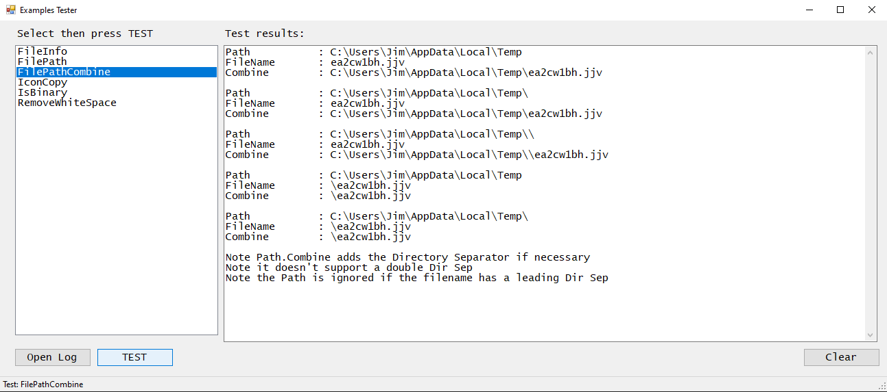

# Examples Tester

## Features
* Test examples
* Add a new test in Form1.cs: public void EXAMPLE_NewTest()
* The program will scan the Form1.cs file and add the new test to the listbox

## Build Environment

Visual Studio 2022 with .Net Framework v4.8

C# Windows Desktop: Windows Forms App (.NET Framework)

## Screenshot

 
