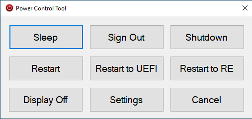

# Power Control Tool

## Features
* See the screenshot below
  * Restart to UEFI = BIOS
  * Restart to RE = Recovery Environment
* Look for the icon in the system tray!

## Build Environment

Visual Studio 2022
.Net Framework v4.8

## Screenshot

 
