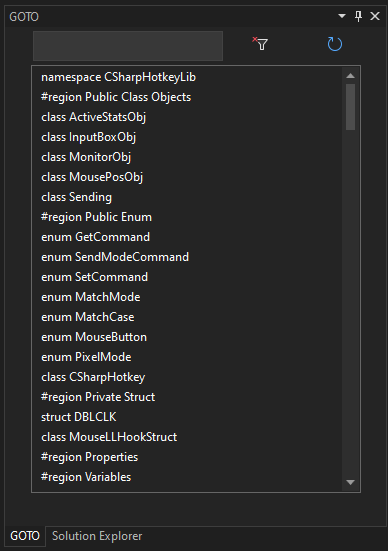

# VSIX GOTO Tool Window

A Visual Studio 2022 Extension to quickly navigate source code.

When a .cs file is selected, the source code outline appears in the GOTO Window.

Double-click on a list view item to GOTO that location in the source code document.

Or click then press ENTER.

Enter text in the textbox to filter the list.

Press the Refresh button to update the list.

When a document is saved, the GOTO list is updated.

## Installation

Build the project, open the output folder.

Double-click on the .vsix file to install.

In the Visual Studio menu, choose "View", "Other Windows", then "GOTO Tool Window"

The GOTO window will be docked to the left of the solution explorer.

Use the menu, Extensions, Manage, to uninstall.

## Screenshot

 

